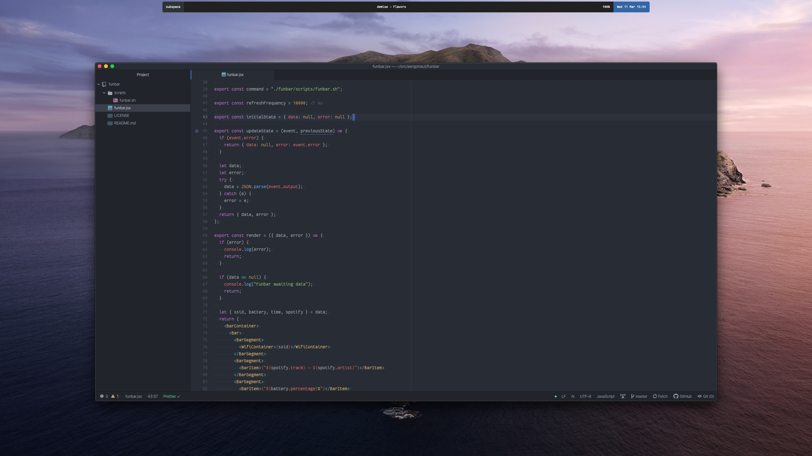

# `funbar`

**funbar** is a status bar for macOS using [Übersicht][1].

## Features

- Current WiFi SSID
- Currently playing track and artist (Spotify)
- Battery percentage
- Time and date

## Prerequisites

funbar requires [shpotify](https://github.com/hnarayanan/shpotify) to provide
Spotify track information.

funbar uses [Fantasque Sans Mono](https://github.com/belluzj/fantasque-sans) as its font face.

## Installing

1. Install [Übersicht][1].
2. Clone this repository to your widgets folder.

## License

Licensed under MIT. See [LICENSE](LICENSE).

[1]: http://tracesof.net/uebersicht/
